# 📜 Technical & Product Specification: Community & Naam Sangh Platform

This document serves as the complete, production-ready specification for the **Community and Naam Sangh (Collaborative Chanting) Platform** within the Divine Melodies Hub application. It is designed to act as a definitive blueprint for developers, architects, and product managers to build and scale the feature to support millions of active devotees.

---

## 1. Overview

### Purpose
The Community Platform connects spiritual seekers, devotees, and singers. It bridges the gap between individual spiritual practices (*Sadhana*) and community interaction (*Satsang*). The core engine merges a modern social feed (similar to Facebook Groups or Reddit Communities) with a collaborative chanting framework called **Naam Sangh**, allowing devotees to chant mantras (*Japa*) toward collective goals.

### Goals
1. **Engagement**: Drive daily active usage through gamified spiritual milestones (devotional streaks, chanting targets).
2. **Crowdsourcing**: Enable community members to share lyrics, verify chords, upload wallpapers, and submit bhajan metadata.
3. **Connectivity**: Form virtual temples where users can organize, discuss, and request devotional materials.
4. **Retention**: Provide visual progression (XP, levels, badges) to encourage consistent spiritual discipline.

### Vision
To build the world's largest digital "Satsang" platform where technology facilitates ancient practices, ensuring high-quality, moderated, and respectful devotional interaction.

### User Problems Solved
* **Disconnection**: Devotees practicing in isolation find it hard to maintain consistency.
* **Inaccurate Content**: Missing or incorrect lyrics for rare regional bhajans.
* **Spiritual Accountability**: Lack of tracking mechanisms for group chanting commitments (*Naam Simran*).
* **Discoverability**: Hard to discover authentic temple events, rare posters, or quality audio.

### Main Use Cases
1. **Naam Sangh Campaigns**: Devotees form a group, select a deity (e.g., Rama Ji), set a target (e.g., 1 Lakh chants of "Jai Shree Ram"), and track progress on shared leaderboards.
2. **Bhajan Requests**: A user requests lyrics or audio for a rare bhajan. Others submit verified transcripts, which are reviewed by moderators and merged into the main library.
3. **Satsang Events**: Admin/verified members create virtual or physical satsang events, and users RSVP.
4. **Daily Darshan & Wallpapers**: Sharing sacred daily images, high-quality graphics, and custom-created spiritual posters.

### User Journey
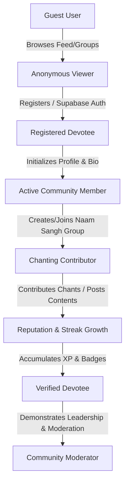

---

## 2. Community Architecture

The platform uses a highly scalable decoupling pattern. The frontend is a single-page application communicating with Supabase and Cloudinary.

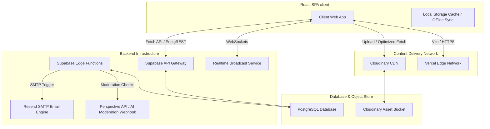

### Architectural Subsystems

1. **Frontend**: React (Vite), Tailwind CSS, Lucide icons, Framer Motion for responsive animations.
2. **Backend**: Supabase PostgREST auto-generated REST APIs + Deno-based Edge Functions for transaction-heavy or third-party tasks (e.g., SMTP sending, AI content moderation).
3. **Database**: PostgreSQL on Supabase with partition logic, indices, triggers, and Row-Level Security (RLS).
4. **Storage**: Cloudinary handles user uploads (images, wallpapers, posters, avatar images) and serves them via an optimized CDN path using dynamic transformations (e.g., `q_auto,f_auto`).
5. **Authentication**: Supabase Auth (JWT tokens, email-verification, Google OAuth).
6. **Moderation**: Postgres Triggers check text fields against a blocked-words table. High-volume media uploads trigger an asynchronous Edge Function executing image-safety scans.
7. **Notifications**: PostgreSQL triggers insert records into the `notifications` table. A Supabase Realtime channel broadcasts them to connected clients. If offline, the notifications table triggers an email via Resend.
8. **Realtime**: WebSockets via Supabase Realtime manage typing indicators, live comment streams, live reaction count updates, and online presence counters in Naam Sangh groups.
9. **Search**: Full-Text Search using Postgres `tsvector` and `tsquery` over posts, groups, and lyrics.
10. **Analytics**: Asynchronous event tracking into an analytical table (`community_analytics`) for tracking views, clicks, shares, and engagement rates.

---

## 3. User Roles

We define a strict hierarchical RBAC (Role-Based Access Control) matrix:

| Role | Description | Permissions |
| :--- | :--- | :--- |
| **Guest** | Unauthenticated user browsing the app. | • View public posts<br>• View public Naam Sangh groups<br>• Read comments |
| **Logged-in User** | Authenticated devotee. | • Create posts (thoughts, quotes)<br>• Join public Naam Sangh groups<br>• Add comments & reactions<br>• Track daily chants |
| **Verified User** | Devotee with verified credentials/high reputation. | • Create new Naam Sangh groups<br>• Upload custom wallpapers/posters<br>• RSVP to events |
| **Moderator** | Elevated devotee responsible for feed safety. | • Hide/remove reported posts & comments<br>• Mute disruptive users<br>• Flag suspicious uploads |
| **Admin** | Core staff with access to administrative panels. | • Approve bhajan requests to enter official library<br>• Ban/unban users<br>• Create official festival events |
| **Super Admin** | Platform owners. | • Full access to database schemas, configuration, database triggers, and API settings |

---

## 4. Authentication

### Auth Methods
1. **Email / Password**: Traditional login using Supabase Auth.
2. **Google OAuth**: One-click registration using native redirect or popup.
3. **Anonymous (Guest Session)**: Enables users to track chanting sessions (*Japa*) locally before signup.

### Registration Flow
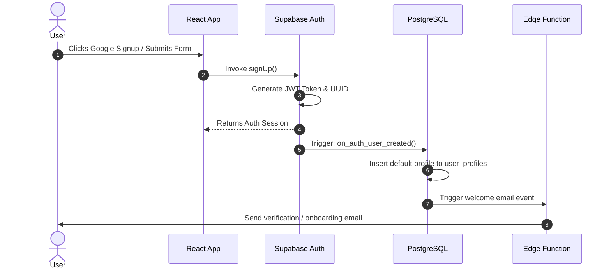

### Guest to Registered Transition
When a Guest logs in or registers:
1. Client detects local storage chant history (`raghavam_naam_sangh_members_v2`).
2. Client sends a batch update API call to Supabase to add local offline chants to the user's permanent database record.
3. Local storage is cleared and synchronized with the remote PostgreSQL database.

---

## 5. User Profile

### Schema Fields
* **id**: UUID (Primary Key, matches `auth.users.id`)
* **username**: VARCHAR(30) (Unique, lowercase, validated using regex `/^[a-zA-Z0-9_]{3,30}$/`)
* **display_name**: VARCHAR(50) (User's visible name, supports Hindi/Unicode)
* **avatar_url**: TEXT (CDN link to avatar image)
* **bio**: VARCHAR(160) (Devotional summary or favorite quote/mantra)
* **followers_count**: INTEGER (Default 0)
* **following_count**: INTEGER (Default 0)
* **total_posts**: INTEGER (Default 0)
* **reputation_points**: INTEGER (Default 100)
* **devotional_streak**: INTEGER (Default 0)
* **max_streak**: INTEGER (Default 0)
* **last_active_date**: DATE (Used to compute streak decay)
* **level**: INTEGER (Default 1)
* **badges_earned**: JSONB (Array of objects detailing badge ID and award date)

### Edit Profile Flow
1. User clicks "Edit Profile" from their dashboard.
2. User can upload a new avatar. The client triggers a direct-to-Cloudinary unsigned upload using the `profile_avatars` folder preset.
3. Cloudinary returns the secure URL.
4. Client validates display name (1-50 chars) and username uniqueness (via a debounced database query).
5. User clicks "Save". Updates are written to the database via RLS policy: `auth.uid() = id`.

---

## 6. Community Home Feed

The home feed handles content discovery.

### Feed Types
1. **Latest**: Flat chronological feed of posts across all joined groups.
2. **Following**: Chronological feed restricted to authors the user follows.
3. **Trending / Popular**: Ranked by an engagement decay algorithm.
4. **Recommended**: Algorithmic feed based on the user's followed deities.

### Churn and Ranking Algorithm
Trending score is calculated hourly using a PostgreSQL materialized view:

$$\text{Score} = \frac{R + 2C + 5B - 1}{(T + 2)^{1.5}}$$

Where:
* $R$ = Reaction Count (Likes, Folded Hands, Jai Shri Ram, etc.)
* $C$ = Comment Count
* $B$ = Boost factor (Admin pins or promotional boosts)
* $T$ = Age of post in hours

### Materialized View Refresh Mechanism
To maintain performance under high loads, the Trending feed queries a materialized view `trending_posts_view` instead of performing live joins. This view is refreshed every 15 minutes via a cron job running `REFRESH MATERIALIZED VIEW CONCURRENTLY trending_posts_view`.

---

## 7. Posts

### Supported Post Types

```
┌────────────────────────────────────────────────────────┐
│                      Post Types                        │
├──────────────┬─────────────────────────────────────────┤
│ Text         │ Pure thoughts, mantra quotes, queries   │
├──────────────┼─────────────────────────────────────────┤
│ Image        │ Single or multiple wallpaper files      │
├──────────────┼─────────────────────────────────────────┤
│ Bhajan Share │ Link to an existing bhajan with status  │
├──────────────┼─────────────────────────────────────────┤
│ Poll         │ Devotional queries with vote options    │
├──────────────┼─────────────────────────────────────────┤
│ Event        │ Temp details, dates, RSVP targets       │
└──────────────┴─────────────────────────────────────────┘
```

### Post Lifecycle
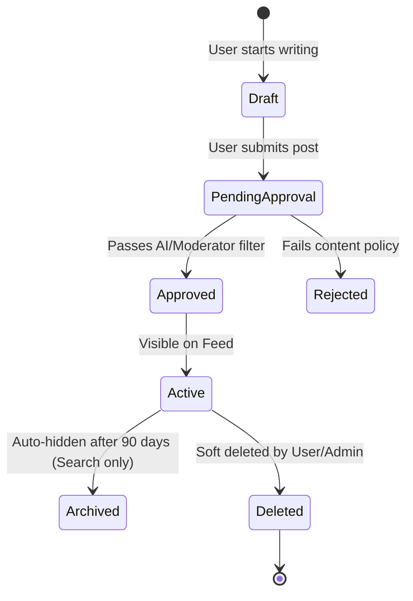

* **Create**: Client-side form checks fields. Media uploads are processed via Cloudinary. Post object is written to `community_posts` in Supabase.
* **Edit**: Users can edit text within 24 hours. A history of edits is kept in `post_edit_history`.
* **Delete**: Soft delete. Sets `status = 'removed'`. Only admins can permanently purge.
* **Archive**: After 90 days of inactivity, posts are automatically flagged as archived to clean up main feed index scans.
* **Share**: Generates unique short URLs (e.g., `raghavam.in/post/id`).
* **Schedule**: Scheduled posts are written to `scheduled_posts` and processed by a cron trigger running every minute.

---

## 8. Comments

Comments are nested to support structured discussions.

### Features
1. **Threading**: Supported up to 3 levels deep (Comment -> Reply -> Nested Reply). Further replies are flattened.
2. **Mentions**: `@username` parsing using regex. Automatically inserts a mention link and alerts the tagged user.
3. **Devotional Submissions**: Users can submit lyrics directly to a `bhajan_request` post. These comments are visually styled with a green border and contain an "Approve and Add to Library" button for moderators.
4. **Realtime Updates**: New comments are appended to the UI immediately using Supabase Realtime channel subscription `post_comments:post_id=eq.${postId}`.

---

## 9. Likes & Reactions

Instead of standard social reactions, we use custom devotional reactions:

| Reaction | Unicode / Icon | Meaning | Weight (Ranking) |
| :--- | :--- | :--- | :--- |
| **Pranam** | 🙏 | Folded Hands (Respect) | 1.0 |
| **Prem** | ❤️ | Heart (Love) | 1.0 |
| **Om** | 🕉️ | Sacred Sound | 1.5 |
| **Jai Shri Ram** | 🏹 | Victory to Lord Ram | 2.0 |
| **Har Har Mahadev** | 🔱 | Glory to Lord Shiva | 2.0 |
| **Radhe Radhe** | 🪈 | Love of Radha-Krishna | 2.0 |

Users can react to posts and comments. Reactions are toggled. A single user can apply up to two different reactions to a single post to express both respect (🙏) and deity-specific devotion (🔱).

---

## 10. Sharing

Sharing is optimized for mobile channels.

### Deep Linking Architecture
We use standard deep links and fallback paths:
* **iOS**: Universal Links (`apple-app-site-association` file in `.well-known`).
* **Android**: App Links (`assetlinks.json` in `.well-known`).
* **Fallback**: Web browser renderer that mimics the mobile UI but prompts download.

### Sharing Methods
1. **Copy Link**: Copies shortened URLs with tracking parameters: `?utm_source=copy_link&utm_medium=social`.
2. **WhatsApp / Telegram API**: Uses URI schemes for fast sharing with pre-filled text.
3. **QR Code Generator**: Client-side QR generation for event posts, allowing offline sharing at temples.

---

## 11. Following System

Users can follow other devotees to customize their feed.

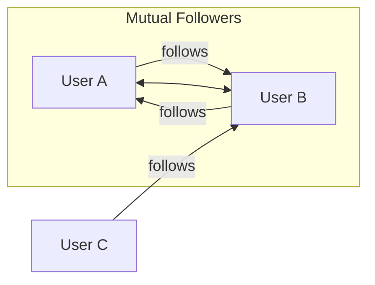

* **Follow/Unfollow**: Handled via `user_connections` table. Requires RLS validation so a user can only follow on behalf of their authenticated user ID.
* **Suggested Users**: Computed daily based on:
  1. Mutual follows.
  2. Commonalities in Naam Sangh groups joined.
  3. Active chanting status.
* **Hashtag Following**: Users can follow tags like `#HanumanChalisa` to inject related posts directly into their primary feed.

---

## 12. Notifications

The notification system uses a hybrid real-time/batch delivery pattern.

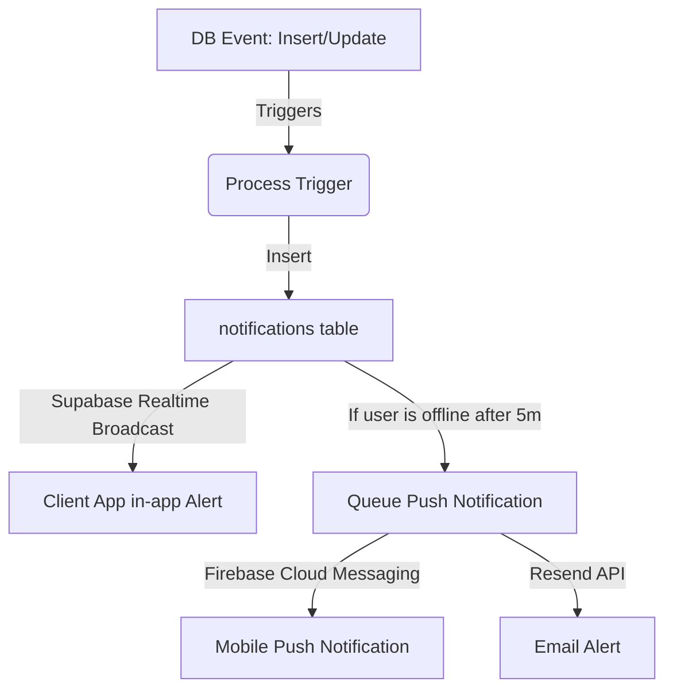

### Notification Trigger Registry
* **Like/Reaction**: Sent instantly (in-app only).
* **Comment/Reply**: Sent instantly (in-app + push).
* **Mention**: Sent instantly (in-app + push + email if enabled).
* **Follow**: Sent instantly (in-app).
* **Post Moderation**: Sent on status update to 'approved' or 'removed' (in-app + email explaining the reason).
* **Naam Sangh Milestone**: Sent when a group reaches 25%, 50%, 75%, and 100% of their chanting target (sent to all group members).

---

## 13. Moderation

To ensure a safe environment, moderation utilizes an automated pipeline followed by community reporting.

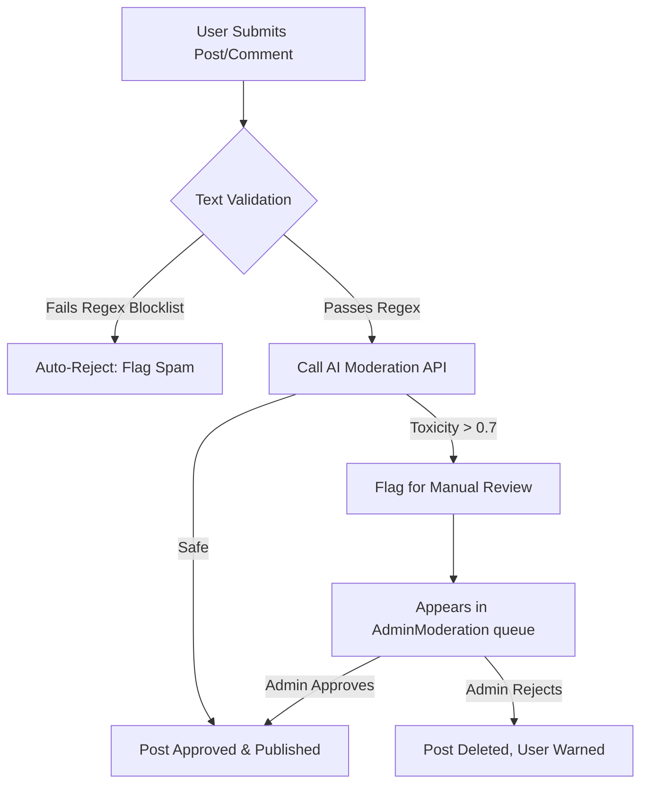

### Rules & Penalties
* **First Offense**: Post removed, warning issued via email.
* **Second Offense**: 3-day mute (user can read but not write).
* **Third Offense**: Permanent ban.
* **Shadow Banning**: Banned users can post, but their posts are only visible to themselves. This prevents them from simply registering new accounts.

---

## 14. Search

Search queries use full-text indexing in Postgres.

```sql
-- Search query optimization script
CREATE INDEX IF NOT EXISTS community_posts_search_idx 
ON community_posts 
USING gin(to_tsvector('english', coalesce(title, '') || ' ' || content));
```

### Search Features
1. **Prefix Search**: As user types, fetch matching users and hashtags using a fast trie-based search index.
2. **Advanced Filters**: Filter posts by date range, deity, media type (audio, video, image), or group name.
3. **Search History**: Stored locally on the user's device for privacy, with an option to clear all searches.

---

## 15. Hashtags

Hashtags connect posts across different groups.

* **Database Link**: Hashtags are parsed from posts during insertion. The trigger extracts words matching `/#\w+/g` and populates the `post_hashtags` relationship table.
* **Trending Hashtags**: Computed by counting the occurrences of hashtags in the last 48 hours.
* **Hashtag Pages**: Navigating to `/hashtag/ram` displays all posts containing `#ram`, sorted by trending score.

---

## 16. Media Uploads

All user-generated media is optimized before storage.

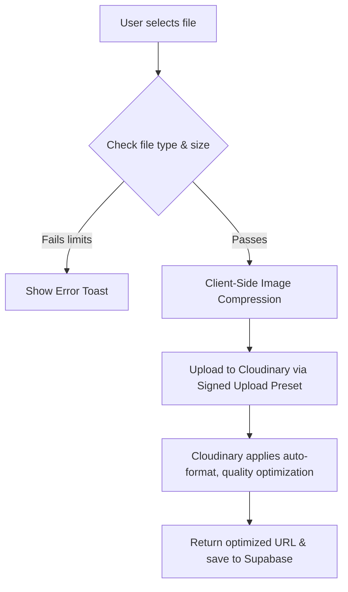

### Upload Rules & Limits

| Media Type | Max Size | Allowed Formats | Cloudinary Transformation Path |
| :--- | :--- | :--- | :--- |
| **Profile Photo** | 2 MB | JPG, PNG, WEBP | `w_300,h_300,c_fill,g_face,q_auto,f_auto` |
| **Post Images** | 5 MB | JPG, PNG, WEBP | `w_1200,c_limit,q_auto,f_auto` |
| **Wallpapers** | 10 MB | JPG, PNG, HEIC | `w_1080,h_1920,c_fit,q_auto,f_auto` |
| **Bhajan Audio** | 15 MB | MP3, M4A, WAV | Served from secure Cloudinary audio folder |

---

## 17. Real-time Features

Real-time capabilities are built on Supabase Realtime Channels.

1. **Typing Indicators**: Uses ephemeral state synchronization (*Presence*) to broadcast when a user is typing a reply:
   ```typescript
   channel.track({ user: username, typing_to: postId })
   ```
2. **Live Counters**: Broadcasts current active counters in a Naam Sangh group. Shows "42 Devotees Chanting Now" with glowing pulse animations.
3. **Live Likes**: Toggling a reaction broadcasts the event to all users viewing the post, updating counters instantly.

---

## 18. Messaging (Future Roadmap)

While not in the initial release, the messaging architecture is planned as follows:

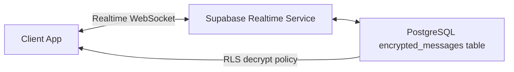

* **One-to-One Chat**: Encrypted using AES-256-GCM. Decryption keys are stored locally on user devices.
* **Group Chats**: Tied directly to Naam Sangh groups, allowing group members to coordinate chanting sessions.
* **Voice Notes**: Short devotional recordings (under 30s) stored in secure object buckets.

---

## 19. Leaderboards

Leaderboards motivate community members through friendly competition (*Dharma Prachar*).

```
┌────────────────────────────────────────────────────────┐
│                      Leaderboards                      │
├──────────────┬─────────────────────────────────────────┤
│ Daily        │ Refreshes at 00:00 IST                  │
├──────────────┼─────────────────────────────────────────┤
│ Weekly       │ Refreshes Monday morning                │
├──────────────┼─────────────────────────────────────────┤
│ Monthly      │ Refreshes on 1st of month               │
├──────────────┼─────────────────────────────────────────┤
│ All Time     │ Lifetime totals                         │
└──────────────┴─────────────────────────────────────────┘
```

### Scoring Logic
Points are awarded for various devotional activities:
* **Chant logged**: 1 point per 108 chants.
* **Post created**: 5 points (maximum 3 posts per day to prevent spam).
* **Comment reply**: 2 points.
* **Streak milestone reached (e.g., 7 days)**: 50 bonus points.

---

## 20. Gamification

The gamification system encourages consistent spiritual practice.

### Level Progression
Levels are calculated based on cumulative XP:

$$\text{Level} = \text{Floor}(0.1 \times \sqrt{\text{XP}}) + 1$$

### Achievements and Badges
* **Pratham Jap**: Completed first chanting session (108 chants).
* **Nitya Sadhak**: Maintain a 7-day chanting streak.
* **Sangh Nayak**: Created a Naam Sangh group that reached 100% of its target.
* **Shabd Sevi**: Contributed 5 verified lyrics to the bhajan library.

---

## 21. Admin Panel

The admin panel is accessible to roles with `moderator` or `admin` flags.

1. **Dashboard**: View active users, total daily chants, reported posts, and new user signups.
2. **Post Approval Queue**: Approve or reject posts flagged by AI filters.
3. **User Management**: Search profiles, edit roles, mute accounts, or apply bans.
4. **Festival Scheduler**: Schedule banners, select a featured bhajan of the day, and set system-wide community chanting goals for upcoming holidays (e.g., Janmashtami).

---

## 22. Database Design

Below is the production schema for the community platform.

### Table: `user_profiles`
Holds public user metadata. Extends `auth.users`.

```sql
CREATE TABLE user_profiles (
    id UUID PRIMARY KEY REFERENCES auth.users(id) ON DELETE CASCADE,
    username VARCHAR(30) UNIQUE NOT NULL,
    name VARCHAR(50) NOT NULL,
    avatar_url TEXT,
    bio VARCHAR(160),
    followers_count INTEGER DEFAULT 0,
    following_count INTEGER DEFAULT 0,
    reputation_points INTEGER DEFAULT 100,
    devotional_streak INTEGER DEFAULT 0,
    max_streak INTEGER DEFAULT 0,
    last_active_date DATE,
    level INTEGER DEFAULT 1,
    badges_earned JSONB DEFAULT '[]'::jsonb,
    role VARCHAR(20) DEFAULT 'user' CHECK (role IN ('user', 'verified', 'moderator', 'admin')),
    created_at TIMESTAMP WITH TIME ZONE DEFAULT timezone('utc'::text, now()) NOT NULL,
    updated_at TIMESTAMP WITH TIME ZONE DEFAULT timezone('utc'::text, now()) NOT NULL
);

-- Enable RLS
ALTER TABLE user_profiles ENABLE ROW LEVEL SECURITY;

-- Policies
CREATE POLICY "Public profiles are viewable by everyone" ON user_profiles FOR SELECT USING (true);
CREATE POLICY "Users can update their own profile" ON user_profiles FOR UPDATE USING (auth.uid() = id);
```

### Table: `naam_sangh_groups`
Chanting groups.

```sql
CREATE TABLE naam_sangh_groups (
    id UUID PRIMARY KEY DEFAULT gen_random_uuid(),
    name VARCHAR(50) UNIQUE NOT NULL,
    description TEXT,
    target_count INTEGER NOT NULL CHECK (target_count >= 108),
    created_by UUID REFERENCES user_profiles(id) ON DELETE SET NULL,
    invite_code VARCHAR(15) UNIQUE NOT NULL,
    image_url TEXT,
    is_public BOOLEAN DEFAULT true,
    created_at TIMESTAMP WITH TIME ZONE DEFAULT timezone('utc'::text, now()) NOT NULL
);

-- Indexes
CREATE INDEX idx_groups_invite_code ON naam_sangh_groups(invite_code);
```

### Table: `naam_sangh_members`
User memberships in groups.

```sql
CREATE TABLE naam_sangh_members (
    group_id UUID REFERENCES naam_sangh_groups(id) ON DELETE CASCADE,
    user_id UUID REFERENCES user_profiles(id) ON DELETE CASCADE,
    role VARCHAR(20) DEFAULT 'member' CHECK (role IN ('admin', 'member')),
    joined_at TIMESTAMP WITH TIME ZONE DEFAULT timezone('utc'::text, now()) NOT NULL,
    PRIMARY KEY (group_id, user_id)
);
```

### Table: `community_posts`
Feed posts.

```sql
CREATE TABLE community_posts (
    id UUID PRIMARY KEY DEFAULT gen_random_uuid(),
    group_id UUID REFERENCES naam_sangh_groups(id) ON DELETE SET NULL,
    author_id UUID REFERENCES user_profiles(id) ON DELETE CASCADE NOT NULL,
    type VARCHAR(20) NOT NULL CHECK (type IN ('bhajan_share', 'bhajan_request', 'question', 'thought', 'event')),
    title VARCHAR(100),
    content TEXT NOT NULL,
    image_url TEXT,
    youtube_url TEXT,
    question_options TEXT[] DEFAULT NULL,
    status VARCHAR(20) DEFAULT 'approved' CHECK (status IN ('approved', 'removed')),
    event_datetime TIMESTAMP WITH TIME ZONE,
    event_location VARCHAR(150),
    linked_bhajan_id BIGINT, -- Links to core library
    request_status VARCHAR(30) DEFAULT 'open',
    resolved_bhajan_id BIGINT,
    created_at TIMESTAMP WITH TIME ZONE DEFAULT timezone('utc'::text, now()) NOT NULL
);
```

### Table: `post_comments`
Comments and nested replies.

```sql
CREATE TABLE post_comments (
    id UUID PRIMARY KEY DEFAULT gen_random_uuid(),
    post_id UUID REFERENCES community_posts(id) ON DELETE CASCADE NOT NULL,
    parent_comment_id UUID REFERENCES post_comments(id) ON DELETE CASCADE,
    author_id UUID REFERENCES user_profiles(id) ON DELETE CASCADE NOT NULL,
    content TEXT NOT NULL,
    is_lyrics_submission BOOLEAN DEFAULT false,
    created_at TIMESTAMP WITH TIME ZONE DEFAULT timezone('utc'::text, now()) NOT NULL
);
```

### Table: `post_reactions`
Reactions to posts.

```sql
CREATE TABLE post_reactions (
    post_id UUID REFERENCES community_posts(id) ON DELETE CASCADE NOT NULL,
    user_id UUID REFERENCES user_profiles(id) ON DELETE CASCADE NOT NULL,
    reaction_type VARCHAR(20) DEFAULT 'like' NOT NULL,
    created_at TIMESTAMP WITH TIME ZONE DEFAULT timezone('utc'::text, now()) NOT NULL,
    PRIMARY KEY (post_id, user_id, reaction_type)
);
```

### Table: `post_hashtags`
Hashtags associated with posts.

```sql
CREATE TABLE post_hashtags (
    post_id UUID REFERENCES community_posts(id) ON DELETE CASCADE,
    tag VARCHAR(50) NOT NULL,
    PRIMARY KEY (post_id, tag)
);
CREATE INDEX idx_post_hashtags_tag ON post_hashtags(tag);
```

---

## 23. API Design

All endpoints require standard Bearer Authentication (JWT token generated by Supabase).

### 1. Fetch Group Feed
* **Method**: `GET`
* **URL**: `/api/v1/posts`
* **Query Parameters**:
  * `group_id` (Optional): Filter by group.
  * `limit` (Default 20): For pagination.
  * `cursor` (Optional): ID of the last post loaded.
* **Response**: `200 OK`
  ```json
  {
    "posts": [
      {
        "id": "e0a1c1d4-8d45-4c07-b3ab-b827361a4901",
        "type": "thought",
        "content": "Chanted 108 rounds today. Shanti at last.",
        "author": {
          "display_name": "Rohan Das",
          "avatar_url": "https://res.cloudinary.com/dca1u5/avatar.png"
        },
        "reaction_count": 14,
        "comment_count": 3,
        "created_at": "2026-07-13T08:00:00Z"
      }
    ],
    "next_cursor": "e0a1c1d4-8d45-4c07-b3ab-b827361a4901"
  }
  ```

### 2. Create Post
* **Method**: `POST`
* **URL**: `/api/v1/posts`
* **Headers**: `Authorization: Bearer <jwt_token>`
* **Body**:
  ```json
  {
    "group_id": "c62a809f-405a-47a9-b7a3-691c9d8f4151",
    "type": "thought",
    "content": "Daily reminder to chant Ram Naam.",
    "image_url": null
  }
  ```
* **Response**: `201 Created`

### 3. Log Japa Count (Naam Sangh Update)
* **Method**: `POST`
* **URL**: `/api/v1/sangh/log-chants`
* **Headers**: `Authorization: Bearer <jwt_token>`
* **Body**:
  ```json
  {
    "group_id": "c62a809f-405a-47a9-b7a3-691c9d8f4151",
    "chants": 108
  }
  ```
* **Response**: `200 OK`
  ```json
  {
    "success": true,
    "group_total_chants": 42108,
    "user_total_chants": 1080,
    "reputation_awarded": 10
  }
  ```

---

## 24. Storage Structure

We segregate assets inside Cloudinary to enable target optimization rules.

```
cloudinary://divine_melodies_hub/
├── profiles/
│   └── [user_uuid].webp (Resized to 300x300, face auto-detection)
├── posts/
│   └── [post_uuid]-[timestamp].webp (Max width 1200px, 75% quality)
├── wallpapers/
│   └── [wallpaper_uuid].webp (Max height 1920px, lossless compression)
├── banners/
│   └── [festival_name].webp (Optimized for desktop/mobile responsive crops)
└── audio_temp/
    └── [request_uuid].mp3 (Stored for verification, deleted after library approval)
```

---

## 25. Security

1. **Authentication**: Handled at SQL database layer via PostgreSQL policies. Users can only modify rows matching `auth.uid() = user_id`.
2. **Rate Limiting**: Implemented on API routes via Cloudflare Workers and Upstash Redis.
   * `POST /api/v1/posts`: Max 5 per 15 minutes.
   * `POST /api/v1/comments`: Max 10 per 5 minutes.
3. **Input Sanitization**: Client uses DOMPurify before rendering markdown. Postgres updates enforce strict typing constraints.
4. **Data Privacy**: Users can choose to hide their real name, display email, or chanting stats from the public directory.

---

## 26. Performance

### Database Caching
* Real-time metrics (like member counts) are stored in columns in `naam_sangh_groups` and updated by triggers, avoiding expensive `COUNT(*)` queries on every load.

### Frontend Optimization
* **Virtual List**: Infinite feeds render only elements inside the viewport using `@tanstack/react-virtual`.
* **Prefetching**: Hovering over a Naam Sangh group card initiates prefetching of the group details page.

---

## 27. Accessibility (a11y)

* **Contrast**: Text elements meet WCAG AA requirements (minimum 4.5:1 ratio).
* **Keyboard Control**: Accessible navigation using native focus states and standard keyboard shortcuts (e.g., `Esc` closes dialogs).
* **Screen Readers**: Elements like liking buttons use explicit labels: `<button aria-label="React with Folded Hands to this post" />`.

---

## 28. Mobile UX

Spiritual apps require an intuitive, distraction-free mobile layout:

```
┌────────────────────────────────────────────────────────┐
│  [Logo]              [Search]             [Notification]│
├────────────────────────────────────────────────────────┤
│  [ Deity Marquee Picker: Rama  Shiva  Krishna ]         │
├────────────────────────────────────────────────────────┤
│  ┌──────────────────────────────────────────────────┐  │
│  │                    DAILY STATS                   │  │
│  │  Streak: 7 Days  |   Chants: 108   |   Level: 4  │  │
│  └──────────────────────────────────────────────────┘  │
│  ┌──────────────────────────────────────────────────┐  │
│  │               RECOMMENDED GROUPS                 │  │
│  │  [Ram Bhakt Sangh]         [Hanuman Sangh]       │  │
│  └──────────────────────────────────────────────────┘  │
├────────────────────────────────────────────────────────┤
│                                                        │
│                  COMMUNITY FEED                        │
│  [Card: Devotee Rohan posted "Om Namah Shivaya"]      │
│  - Comments (3)  - React (🙏 🔱 ❤️)  - Share         │
│                                                        │
├────────────────────────────────────────────────────────┤
│ [Home]     [Chant Counter]     [Sangh]     [Profile]   │
└────────────────────────────────────────────────────────┘
```

* **Gestures**: Double tap on a post card triggers the default "🙏 Pranam" reaction. Swipe left to navigate between Home Feed and Joined Groups.
* **Offline Support**: Chants completed offline are queued in IndexedDB and synchronized once a network connection is detected.

---

## 29. Desktop UX

* **Two-Column Layout**: Feed on the left, trending hashtags, user rankings, and active Naam Sangh campaigns on the right.
* **Keyboard Shortcuts**:
  * `N`: Open new post dialog.
  * `/`: Focus search input.
  * `J` / `K`: Navigate feed items.

---

## 30. Analytics

Key metrics tracked on a dashboard:

* **Devotion Metrics**: Total collective chants, average daily chants per user, active streak retention.
* **Engagement**: Comments/reactions per post, sharing rate to WhatsApp.
* **Funnel Conversion**:
  ```
  Guest Session -> Registration -> Join Group -> Log Chants (Goal)
  ```

---

## 31. Notification Flow

This diagram illustrates how notifications are processed and sent to the recipient.

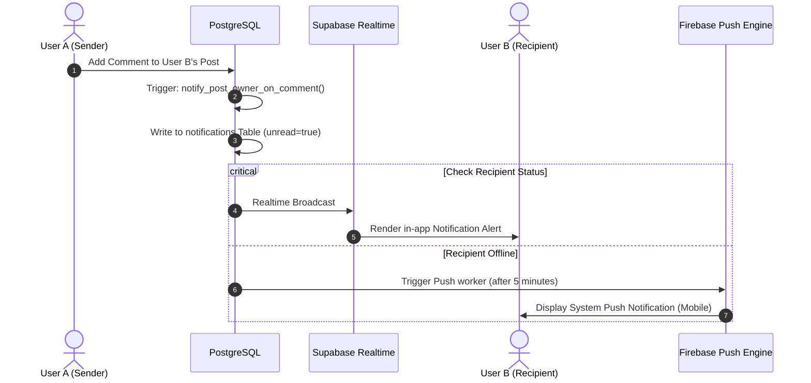

---

## 32. Database ER Diagram

The relationships between core database entities:

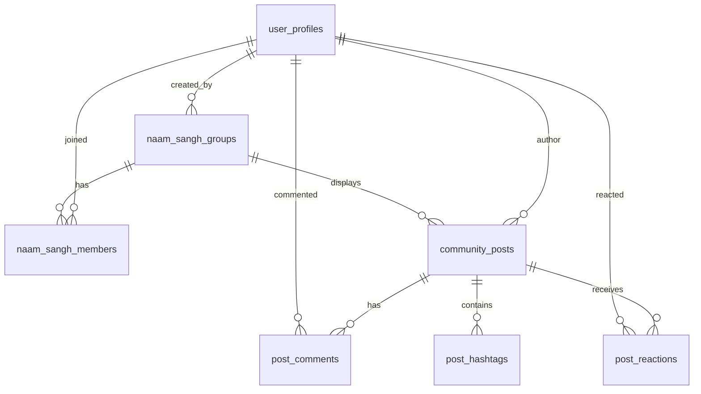

---

## 33. Complete User Flow

Here is the full lifecycle of a user onboarding and engaging with the community:

```mermaid
graph TD
    A[Guest lands on Home page] --> B[Browses Panchang & Wallpapers]
    B --> C[Sees Ram Bhakt Chanting Group target]
    C --> D[Clicks Join -> Prompted to Signup]
    D --> E[Registers via Google OAuth]
    E --> F[Completes Profile: selects display name & avatar]
    F --> G[Joins Ram Bhakt Sangh]
    G --> H[Uses digital Japa Counter to chant 108 times]
    H --> I[Chants added to Group total, gets +10 Reputation]
    I --> J[Posts a reflection "Pranam Devotees! Glad to join"]
    J --> K[Other members react with 🙏 and welcome comments]
    K --> L[User maintains streak, reaches Level 2]
    L --> M[System awards 'First Milestone' badge]
```

---

## 34. Edge Cases

1. **Deleted Accounts**: When a profile is deleted, their posts and comments are retained but reassigned to a default `@deleted_devotee` profile. This preserves thread context.
2. **Offline Race Conditions**: If a user logs 500 chants offline, and simultaneously the group target is met, the sync engine updates the database and continues tracking overflow counts past 100%.
3. **Simultaneous Chants**: If 1,000 users log chants simultaneously, database locks are avoided by writing chant history to a log table (`japa_logs`) and aggregating total counts asynchronously via a queue runner.

---

## 35. Future Features

* **Devotional Challenges**: E.g., "11 Days Hanuman Chalisa Challenge during Navratri".
* **Satsang Audio Rooms**: Live audio spaces for collective mantra chanting.
* **Pilgrimage Forums**: Connect travelers planning visits to holy sites.
* **AI Recommendation Engine**: Recommends bhajans and groups based on your chanting history.

---

## 36. Folder Structure

We recommend the following layout for organized modular development:

```
divine-melodies-hub/
├── supabase/
│   ├── migrations/ (Database schema updates)
│   │   ├── 001_initial_schema.sql
│   │   └── 002_community_features.sql
│   └── functions/ (Edge Functions)
│       ├── send-moderation-emails/
│       └── process-media-safety/
└── src/
    ├── components/
    │   ├── community/
    │   │   ├── PostCard.tsx (Individual feed posts)
    │   │   ├── PostComposer.tsx (Rich post editor)
    │   │   ├── CommentSection.tsx (Nested comment tree)
    │   │   └── ReactionSelector.tsx (Custom devotional reactions)
    │   └── sangh/
    │       ├── SanghCard.tsx (Group statistics and join button)
    │       ├── JapaCounter.tsx (Chanting ring interface)
    │       └── SanghRankings.tsx (Group leaderboard)
    ├── lib/
    │   ├── community/
    │   │   └── communityApi.ts (Client API abstraction layer)
    │   └── naamSangh/
    │       └── naamSanghApi.ts (Chanting groups database helper)
    └── pages/
        ├── CommunityPage.tsx (Main community discovery feed)
        ├── JoinCommunityPage.tsx (Onboarding to chanting campaigns)
        └── account/
            └── SavedPostsPage.tsx (Bookmarks view)
```

---

## 37. Technology Stack

* **Frontend Framework**: React 18 (Vite, TypeScript).
* **Styling & Components**: Tailwind CSS, Shadcn UI library.
* **State Management**: React Query (TanStack Query v5) for cache control.
* **Database & Core Service**: Supabase (PostgreSQL, Realtime WebSockets, Edge Functions).
* **Media Optimization**: Cloudinary CDN.
* **SMTP System**: Resend API.
* **Push Notifications**: Firebase Cloud Messaging (FCM).

---

## 38. Development Roadmap

We suggest a phase-based rollout for implementation:

### Phase 1: Foundation (Weeks 1-2)
* Setup Supabase migrations and enable RLS rules.
* Setup Cloudinary folders and signed upload presets.
* Implement user profile registration triggers.

### Phase 2: Feed Core (Weeks 3-4)
* Build feed rendering and infinite scrolling.
* Implement custom devotional reactions.
* Add comment section with nested threads.

### Phase 3: Naam Sangh & Gamification (Weeks 5-6)
* Launch group creation and invite system.
* Build Japa Counter with offline sync.
* Add leaderboard rankings and level triggers.

### Phase 4: Moderation & Search (Week 7)
* Integrate text search and filter options.
* Setup text filtering and admin moderation panel.

---

## 39. Production Checklist

- [ ] Supabase migrations executed on production database.
- [ ] Row-Level Security (RLS) policies tested and verified for all tables.
- [ ] Cloudinary environment variables verified.
- [ ] Firebase Cloud Messaging configured for push notifications.
- [ ] Blocked-words dictionary uploaded to Postgres database.
- [ ] Materialized views set to refresh on cron schedules.
- [ ] Analytics event pipeline verified in testing environment.

---

## 40. Conclusion

By building the Community and Naam Sangh Platform according to this technical specification, you will deliver a highly interactive, performant, and secure digital space. Using optimized indexes, client-side caching, and CDNs ensures the platform will easily scale to support millions of active devotees.

For questions, updates, or API key configuration guides, refer to [README.md](file:///C:/Users/YASH/Desktop/bhajanwebsite/divine-melodies-hub/README.md) or open a discussion thread in the team documentation workspace.
